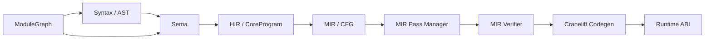

# Joky 编译器架构

本文是编译器文档的总入口。实现位于 `src/`，语言设计位于 [`../lang/`](../lang/)；本文只描述已经存在的编译路径，不把未来计划写成现状。

## 编译流水线

```text
Source
  -> Lexer -> Parser -> AST
  -> Sema (名称解析、类型检查、语义验证)
  -> HIR / CoreProgram
  -> MIR (CFG)
  -> MIR Pass Manager (verifier + optimization passes)
  -> Codegen (Cranelift IR)
  -> Cranelift JIT
  -> Runtime ABI
```

`Compiler::run_program`（`src/compiler.rs`）按这个顺序驱动单个源码程序。包入口在模块图阶段先解析导入；当前编译单元随后把解析后的函数交给同一条 HIR/MIR 路径。

`Frontend`（`src/frontend.rs`，公开导出为 `joky::Frontend`）负责源码到已验证
MIR 的阶段：目标 extern 选择、模块检查、HIR/MIR lowering、泛型实例、模块缓存、
链接及 MIR passes。它不持有 Cranelift backend，也不创建 runtime scope。
`Compiler` 持有此服务，在共同检查流程之后负责 JIT / AOT 和运行时接入。
`check` 停在链接后的 MIR 验证，不裁剪不可达函数，因此未被调用的普通函数也要通过检查。
泛型模板按现有规则在实例化时检查具体类型；没有 `main` 的库可以独立检查。

嵌入调用示例：

```rust,no_run
use joky::{Frontend, module::ModuleGraph};
use std::path::Path;

let graph = ModuleGraph::load(Path::new("src/main.jk"), Path::new(".")).unwrap();
let mut frontend = Frontend::new();
let report = frontend.check(&graph, None).unwrap(); // None 禁用磁盘缓存
assert!(report.source_modules > 0);
```

`CheckReport` 返回源模块、泛型实例、MIR 缓存命中/编译数量，以及本次服务调用中
复用或重新解析的模块图条目数量。
`take_module_events()` 获取本次缓存事件；发生检查错误时，
`take_diagnostic()` 获取包含阶段、消息、路径和字节范围的结构化诊断；
`take_diagnostic_source()` 可取出对应文件和源码，再用 `write_diagnostic` 渲染。
每次 `check` 会清空上次诊断和缓存事件；长期服务保留的模块图缓存不受影响。
模块图加载的诊断由 `ModuleLoadError` 保留来源。
`check_sources` 接受 `SourceFile` 快照，快照内容会覆盖磁盘文件，未保存的编辑器
缓冲区可以直接检查而无需写文件。长期持有同一个 `Frontend` 时，`check_sources` /
`check_sources_all` 会按源码指纹复用模块 ABI 和依赖图元数据；仅变化的模块重新解析，
`clear_incremental_cache` 可主动释放这部分内存。`check_all` / `check_sources_all` 会收集互不依赖
模块的多个错误；依赖失败模块会跳过，不生成级联假错误。原有 `check` 仍返回首个
错误的 `Result`，方便兼容调用方。尚未提供 LSP 协议。检查也不保证外部符号解析、
机器码生成或运行时成功。

模块独立编译先查询 MIR 缓存，未命中才构造语义检查上下文；泛型实例也在
缓存未命中后才复制模板和准备依赖。`src/frontend/module_context.rs` 在一次
编译会话内按需维护已完成模块的只读类型快照，依赖映射和其中的类型表都由
检查器共享。嵌套类型查询通过写时复制隔离自己的临时类型绑定；泛型仍可访问
定义模块、调用方和传递依赖。快照在模块编译结束时释放，链接阶段继续使用
产物自己的类型表。测量范围及结果见 [模块编译基准](../testing/module-compilation.md)。

类型数据按消费阶段拆分：

| 数据 | 保存内容 | 使用与生命周期 |
| --- | --- | --- |
| `CheckedTypes` | NodeId/Span 查询、表达式类型、局部绑定、调用解析、源默认表达式，以及当前模块的类型和接口 | Sema 返回，HIR 与 MIR lowering 消费；不实现序列化，不能进入模块缓存 |
| `ModuleInterface` | 导出签名/常量、泛型请求与模板、trait 方法、导入身份、可重定位的 struct 默认值 | 独立存于模块产物，用于导入检查和实例化 |
| `TypeTable` | 类型索引、布局、effect ABI、ownership 与后端所需的 trait 属性 | `MirProgram` 持有；verifier、链接和 codegen 使用 |

`ModuleTypes` 把布局和接口组合成导入快照，不携带 `CheckedTypes` 的源码节点表。
MIR lowering 从已解析调用生成显式 import stub，模块导入清单从这些 stub 收集。
MIR 缓存格式为 `JKMIR019`；旧格式按 miss 重建。

## MIR 优化框架

MIR lowering 完成后，`MirPassManager`（`src/mir/passes/`）按固定顺序执行优化 pass。管理器在整个流水线开始前验证一次 MIR，并在每个 pass 完成后再次验证；任何 pass 都不能把不满足 MIR 不变量的结果交给后端。

默认流水线目前包含一个保守的 `constant-folding` pass。它只在同一个基本块内折叠已知的标量 `Const` 与 `Binary`，保持所有 `MirValueId` 不变，并跳过字符串、运行时调用、可能除零的除法和所有权相关操作。这样可以先验证 pass 接口和 verifier 边界，同时不改变现有运行时语义。

后续可在同一管理器中加入死代码消除（DCE）、CFG 简化、跨块常量传播和 ownership 优化；每个 pass 都应保持输入输出均为已验证 MIR，并通过独立的回归测试覆盖其变换。

## 各层职责

| 层 | 主要代码 | 职责 | 不负责的事情 |
| --- | --- | --- | --- |
| Syntax | `src/syntax/` | 词法、语法和 AST | 类型正确性、运行时布局 |
| Sema | `src/sema/` | 名称/作用域、类型推断与检查、调用和模式验证 | 生成机器码 |
| HIR | `src/hir/mod.rs` | 携带 `Type` 的规范化表达式树 | 细化 CFG 控制流 |
| MIR | `src/mir/` | 基本块、显式跳转、值定义、所有权操作 | Cranelift 的 ABI 细节 |
| Verifier | `src/mir/verifier.rs` | 检查 MIR 的定义、支配、类型、Phi 和 ownership 约束 | 修复非法 MIR |
| Codegen | `src/codegen/` | 将已验证 MIR 翻译为 Cranelift IR 并链接运行时符号 | 再次做语言级类型检查 |
| Runtime | `crates/joky-runtime/` | `println`、panic、托管对象、字符串、List/Map/Set、任务与 provider ABI | 解析 Joky 源码 |

## 模块依赖



模块图是前端的包级元数据，不是另一种 IR。它为每个文件分配 `ModuleId`、解析导入路径、收集导出函数，并在 lowering 前拒绝循环依赖。

## Effect 与并发边界

当前语言设计把 Effect、结构化任务和 Cown 分成不同层次：

- `effects { ... }` 是函数的计算依赖；`do { ... } with { ... }` 在词法作用域内安装 Handler。
- `suspends` operation 在 lowering 阶段变成显式 continuation/state machine；用户层不使用 `async/await`。
- `scope`、`branch`、`race` 是多 worker 线程上的结构化任务原语，负责 join、失败传播、取消和清理；任务不能逃逸 scope。
- `Cown(T)` 是可复制的共享 capability；payload 图由 runtime 托管并允许 Cown 间接形成环，`when` 获得一个或多个 Cown 的临时独占 lease。lease 不能跨挂起点、任务边界或函数返回。Cown payload 不得直接拥有需要确定性释放的 native handle、task 或 continuation。
- task、Cown acquire/release 和 cancel 的内部操作不能由普通用户 Handler 替换，因为它们有额外的 ownership 不变量。

## 关键边界

- AST 保留源码形状和 `Span`，便于诊断。
- HIR 保留表达式语义，但每个 `CoreExpr` 都带已检查的 `Type`、Effect 和并发上下文信息。
- MIR 不再依赖 AST 节点来表达控制流；`if`、循环、`match`、`scope`、`race` 和挂起点都变成 block、任务指令和显式 terminator。具体结构见 [HIR](hir.md) 与 [MIR](mir.md)。
- Ownership/Concurrency verifier 检查普通值的 move/drop、任务生命周期、continuation spill 和 Cown lease。
- Codegen 只接收通过 pass manager 最终 verifier 的 `MirProgram`。MIR 的控制协议和 continuation kind 是 codegen adapter 的唯一控制流依据；Cranelift 只在 provider 选择时读取 operation identity。运行时功能通过 `RuntimeIntrinsic` 和版本化 C ABI 符号（如 `jk_println`、task/Cown/operation ABI）连接；task 与 continuation ABI 当前版本分别固定为 `TASK_ABI_VERSION = 1`、`CONTINUATION_ABI_VERSION = 1`。函数 lowering 仍串行（`Module` 与 `FunctionBuilderContext` 可变），Cranelift `compile()` 按函数并行，再按入队顺序 `define_function_bytes`。`JOKY_CODEGEN_JOBS` 限制进程内并发编译数。
- Effect、handler/closure environment、managed/Cown、task 和 continuation 的布局描述集中在 runtime ABI descriptor 中，descriptor 版本随 ABI 变更递增。

## 当前限制

默认 CLI 入口是模块化编译（`Frontend` + MIR 缓存）；`Compiler::run_program` 仍提供单段源码的嵌入 / `--legacy` 路径。JIT 与本机 AOT 共用已验证 MIR；同步等待回退已删除，合法挂起点走 machine entry。`List(T)` 将元素展平为稳定的 word 序列，并用可变长度 bitmask 描述其中的 shared 指针；class 保持唯一所有权，不能进入 List。`parallel`、`race`、`branch` 通过 task thunk ABI 进入结构化 task runtime。MIR 控制协议统一为 `Return`、`Abort`、`Suspend`、`Resume`。已实现的 MIR 优化仍限于基本块内的常量折叠。关联类型约束与 `IntoCursor` 容器适配已经落地。尚未完成的语言面包括借用动态 trait 转型。左结合运算符链按左脊迭代检查与 lowering，不再随项数增长占用编译栈；嵌套 `if` / `match` / 调用等前缀形式的递归深度上限为 64，超出时给出带源码位置的诊断。源码到 MIR 的 lowering 在 32MiB 编译栈上运行，避免 debug 构建里超大 `match` 栈帧把合法嵌套程序打崩。AOT 交叉编译与嵌入式 VM 不在当前范围。

## 相关文档

- [HIR 设计](hir.md)
- [MIR 设计](mir.md)
- [模块系统](modules.md)
- [代码生成实现](code-generation.md)
- [类型检查](type-checking.md)
- [错误处理](error-handling.md)
