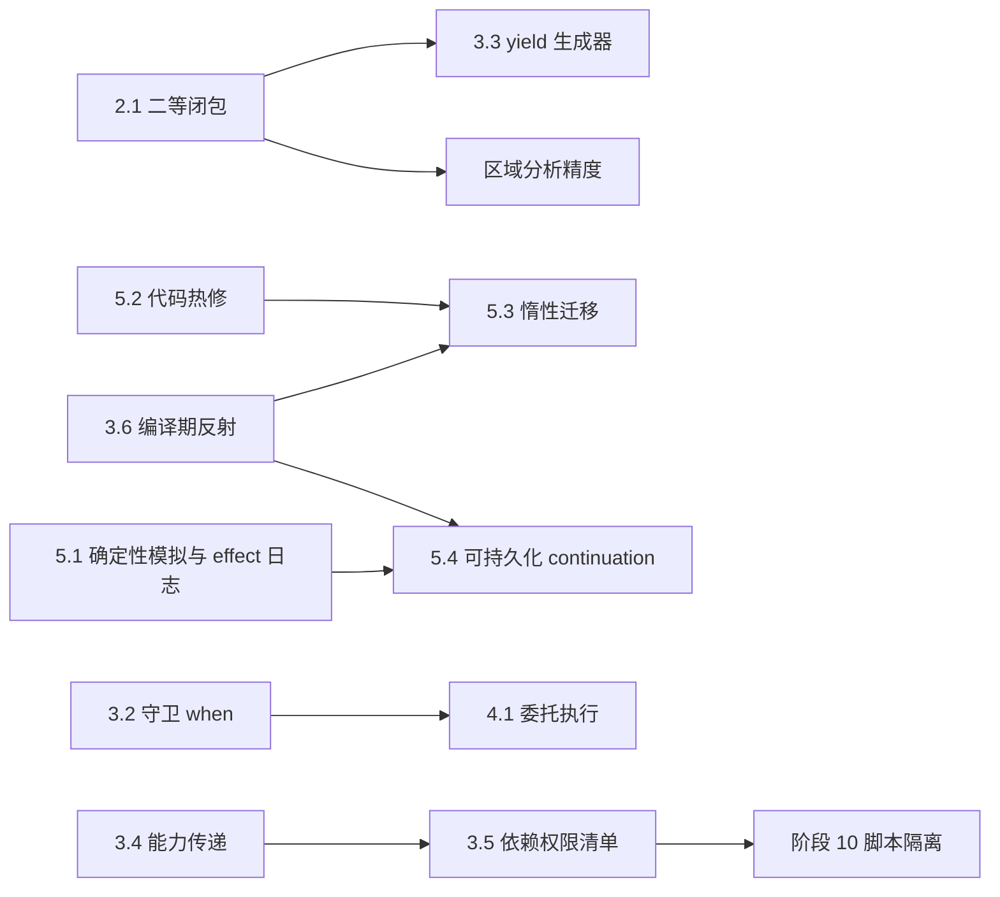

# Joky 愿景：通往 Dream Programming Language

2026-09-24 草案。本文是方向文档，不是阶段承诺：每一项在实施前都要拆出独立计划，
写明语义、兼容性、验收和测试矩阵。标注"已采纳"的条目已确定方向，其余为提案。

## 0. 判断标准

Joky 的地基已经少见地完整：Effect 与 Handler、多 worker 结构化并发、唯一所有权、
`Cown` + `when` + `region`、编译器生成的无栈挂起，以及 JIT / AOT 共用的 IR。
离"梦想语言"的差距主要不在缺少特性，而在几处接缝让用户替编译器做机械选择。

后续取舍按以下标准判断：

1. **用户不替编译器做机械选择**。同步还是挂起、可变还是不可变容器、错误如何转换，
   能由编译器推导的就不交给用户。
2. **默认安全，代价显式**。安全的写法应当是最短的写法；绕过检查必须可见、可审计。
3. **复用已有关口**。Effect、挂起点、`when`、`region` 已经收拢了全部外部操作、
   不确定性和共享可变状态。新能力优先建立在这些关口上，而不是另开通道。
4. **以长期运行的服务端（尤其游戏服务器）为验证场景**。每项设计都要回答：
   能否写出不因单个客户端失败而整体受损、可观测、可热更新的服务。

## 1. 保留的地基

以下设计不改变方向，只在后文中补强：

- Effect 描述计算可能请求的操作，trait 描述值的接口，capability 描述资源访问权；
- `scope` / `branch` / `race` 是语言级结构化任务原语，不能被用户 Handler 替换；
- 不提供 Actor、mailbox 或 `async/await`，挂起性沿调用链由编译器推导；
- 共享可变状态只能通过 `Cown` + `when` 访问，lease 不跨挂起点、不逃逸；
- Cown 采用区域生命周期，句柄不做原子引用计数，同一区域内允许环
  （见 [统一 Region 生命周期](../runtime/regions.md)）；
- 所有 lowering 在编译期完成，未实现的路径给出源码位置诊断，不悄悄回退。

## 2. 需要修正的设计

### 2.1 Effect 透明的二等闭包

**现状**

- 匿名函数不能标注 `@suspends` 或 `effects`，需要挂起时只能写具名函数
  （[闭包约束](../lang/closures.md#5-约束与非目标)）；
- 迭代协议写明"effect 多态的泛型迭代组合子暂不提供"
  （[iteration-protocol.md](iteration-protocol.md)），SQLite 游标文档同样注明当前无 effect 多态。

**问题**：`ids.map(|id| load_user(id))` 这类最自然的代码写不出来，库作者必须为
有 effect 和无 effect 的情况各写一遍，高阶函数和 Effect 系统是断开的。

**提案**：参考 Effekt，不引入用户可见的 effect 行变量。

- 以借用方式传入、不会逃逸的闭包是"二等函数"。它的 effect 集合和挂起性归属于
  **调用点**，高阶函数签名不写 effect；
- 只有被存储、返回或移交任务的闭包是一等函数值，类型上必须写出 effect：
  `fn(T) -> U effects { Network }`；
- 高阶函数按"闭包 effect 集合 + 是否挂起"单态化，一份同步实例、一份可挂起实例，
  复用现有泛型实例化和模块缓存机制。

```joky
// 设想
fn map(xs: List(T), f: &fn(T) -> U) -> List(U) { ... }

fn load_all(ids: List(String)) -> List(User) effects { Network } {
    ids.map(|id| load_user(id))    // Network 与挂起性归属此处
}
```

**附带收益**：单态化后，闭包调用在实例中是已知的直接调用。区域分析目前把间接调用
按"可能写入全部参数"保守处理，并因此拒绝 `when` 内的间接调用
（[区域首版限制](../runtime/regions.md#33-首版保守限制)）；二等闭包可以让这部分检查变精确。

**开放问题**：二等闭包能否捕获 `var`（当前普通闭包禁止）；单态化带来的代码膨胀上限；
`Dyn` 方法接收闭包时的规则。

### 2.2 类型化错误与三种失败机制的分工

**现状**

- 标准库几乎统一返回 `Result(T, String)`，例如 `TcpStream.read`，调用方无法区分
  连接重置和超时，只能比较字符串；
- `?` 要求包装类型与函数返回类型完全一致，不做错误转换；
- 旗舰示例 [echo_server.jk](../../examples/networking/echo_server.jk) 的网络读写使用 `!`，单个客户端出错即 panic。

**提案**

- 标准库改用类型化错误枚举（如 `IoError.ConnectionReset`、`IoError.TimedOut`），
  并提供 `Error` trait：面向用户的消息和可选的来源链；
- `?` 通过 `From` 风格的转换 trait 把内层错误转换为函数声明的错误类型；
- 明确三种失败机制的职责，并在文档和 lint 中体现：

| 机制 | 用途 | 处理方式 |
|---|---|---|
| `Result` | 预期内的业务或 I/O 错误 | `match`、`?`、组合子 |
| `@aborts` operation | 需要由外层 Handler 接住的非本地退出 | `do ... with` |
| `panic` | 程序缺陷、不变量被破坏 | 不恢复，只做清理 |

- 库代码中的 `!` 给出 lint 警告；示例程序中的网络代码改用 `?` 或显式处理。

```joky
// 设想
fn load() -> Result(Config, AppError) {
    let text = file.read(path)?     // IoError 经转换 trait 成为 AppError
    parse(text)?
}
```

**兼容性**：provider 返回的错误载荷布局会改变，需要同步 std 声明、runtime 结果写入
和 provider 契约测试；可以先保留 `.message()` 以便迁移。

### 2.3 一套值语义集合，原地更新由编译器决定

**现状**：`List` / `MutList`、`Map` / `MutMap`、`Set` / `MutSet` 成对存在；
默认 `List` 是持久化单链表，缓存局部性差。

**提案**：参考 Koka 的 Perceus / FBIP。共享值已经使用引用计数，所有权 pass 已规划
`reuse`，因此：

- 不可变集合在引用计数为 1 时原地更新，`let xs = xs.push(4)` 在唯一持有时编译为
  原地追加；
- 默认 `List` 改为持久化向量（RRB 树或分块数组），单链表降级为 `Stack` / `Seq`；
- `Mut*` 系列只保留给 FFI 和确实需要引用身份的场景，文档不再把它作为常规选择。

**开放问题**：原地更新与 `region` 未来的通用 arena 如何衔接；性能可预测性
（何时退化为复制）需要诊断工具呈现，例如 `joky check --explain-reuse`。

### 2.4 统一的默认整数类型

**现状**：整数字面量默认 `Int32`（[类型检查](../compiler/type-checking.md)），
而 `length()` 等长度与大小返回 `UInt64`，日常代码需要频繁转换。

**提案**：引入 `Int`（64 位有符号）作为字面量、下标、长度和计数的统一默认类型；
带位宽的类型用于存储布局、协议字段和 FFI。继续保持溢出检查。

### 2.5 小修

- 让双向类型推断覆盖更多位置，推荐写 `None`、`Ok(x)`，而不是 `Option(T).None`；
- README 补上 Effect、结构化并发、`Cown` / `when` / `region`，这些才是 Joky 的核心卖点。

## 3. 需要补充的概念

### 3.1 面向长期服务的结构化并发

**现状**：任一 branch 的未处理 `@aborts` failure 会取消同一 scope 的其余 branch
（[Effect 与结构化并发](../lang/effects.md#4-effect-与结构化并发)）。对 `accept` 循环中
逐个启动会话的服务器，这意味着一个会话失败会取消全部会话。

**提案**

- **故障隔离策略**：`scope(on_failure: isolate)` 下，branch 失败交给 Handler 记录，
  不取消兄弟 branch；默认策略保持现状；
- **取消作用域与截止时间**：`within(2s) { ... }` 建立类似 Trio 的取消作用域，
  截止时间沿任务树向下传播，所有挂起点都遵守，超时得到类型化的 `TimedOut`。

```joky
// 设想
scope(on_failure: isolate) {
    loop {
        let conn = listener.accept()?
        branch { run_session(conn) }
    }
}

let user = within(2s) { load_user(id) }
```

**开放问题**：隔离策略下失败的记录与观测接口；是否需要重启策略（supervisor），
还是交给用户代码循环实现。

### 3.2 连接读写分离与带守卫的 `when`（已采纳）

动机：`TcpStream` 是唯一资源，会话任务阻塞在 `read` 上时无法及时主动推送；
Cown payload 不能持有 socket，`when` body 不能挂起，也没有挂起等待通知的原语。

- **`split`**：把连接拆成可分别移交给两个 branch 的读端和写端。runtime 同一 fd 只注册
  一次，读等待者与写等待者分槽分发就绪事件。实现进行中。
- **带守卫的 `when`**：守卫在 lease 下求值；为假时释放 lease，把 continuation 挂到该
  Cown 的等待队列；该 Cown 每次释放时重新检查。body 仍不能挂起，lease 规则不变。
  Pending 获取和每 Cown 等待队列已具备（[Cown 调度](../runtime/cown-scheduling.md)），
  守卫等待可以复用。

```joky
// 设想的语法
fn write_loop(writer: TcpStream, outbox: Cown(Outbox)) effects { tcp } {
    loop {
        let batch = when (outbox) |state| until !state.pending.is_empty() {
            state.take_all()
        }
        let _ = writer.write(batch)?
    }
}
```

推送侧的 `when` 永不挂起，背压策略（队列上限、丢弃或踢出慢客户端）写在 `Outbox` 中。

### 3.3 `yield` effect：统一迭代器与异步流

现有 `Cursor` / `IntoCursor` 协议要求手写状态机。一次性 `@resumable` continuation 和
无栈挂起已经具备，生成器可以用普通直线代码书写：

```joky
// 设想
fn ticks() -> Stream(Int) {
    for i in 0.. {
        yield(i)
        time.sleep(16ms)    // 生成器可以挂起，自然成为异步流
    }
}
```

同步迭代器、异步流和分页查询共用一种写法，仍然不需要 channel。
生成器应当实现现有 `IntoCursor`，被 `for` 直接消费。

### 3.4 能力传递，去掉环境权限

[Effect 文档](../lang/effects.md#1-核心模型) 已经说明 effect 不是权限的唯一来源，
但标准库仍是环境权限：`tcp.connect(host, port)` 可以连接任意地址。

**提案**：`main` 接收系统能力对象，由调用方逐层收窄后传递：

```joky
// 设想
fn main(sys: System) effects { tcp } {
    let net = sys.net.only(host: "127.0.0.1")
    serve(net)    // serve 只能使用受限的网络能力
}
```

Effect 回答"能做哪类操作"，capability 回答"能碰哪个资源"。与 3.5 的依赖清单
合起来构成完整的安全模型，也是阶段 10 脚本和游戏模组隔离的基础。

### 3.5 依赖的 effect 权限清单

```toml
[dependencies]
json = { version = "1.2", effects = [] }            # 纯计算
metrics = { version = "0.3", effects = ["tcp"] }
```

编译器读取依赖在 `.jabi` 中导出的 effect 集合，超出清单即报错：编译期检查，
运行时零开销。需要为 `extern` C 函数和其他原生调用引入伪 effect `ffi`，否则会留下缺口。
阶段 10 的 `Engine` 可以把"配置 provider 可用范围"从运行时白名单升级为加载候选模块
时的静态验证。

局限：不限制 CPU 与内存消耗，不等于不可信代码的完整沙箱。

### 3.6 编译期反射，统一"派生"

默认 `Debug` 目前是编译器特例。协议编解码、热更新状态迁移、确定性模拟的 effect 日志、
可持久化 continuation 都需要遍历类型结构。Joky 的类型已经是编译期值（`T: type`），
可以扩展为编译期反射：

```joky
// 设想
impl(T: type) Codec for T where T.is_struct {
    comptime for field in T.fields { ... }
}
```

目标是让 `Debug`、`Eq`、`Hash`、`Codec` 和迁移函数都能以普通 Joky 代码实现，
并删除对应的编译器特例。

## 4. 运行时与性能方向

### 4.1 `when` 委托执行（flat combining）

[Cown 调度基准](../runtime/cown-scheduling.md#基准) 显示，接入 Pending 后短 body、
高竞争场景明显退化（8 worker 下共享热点 79.9 → 326.6 ms，重叠双 Cown 45.9 → 306.4 ms）。

`when` body 已经不能挂起、不能捕获 lease、不能嵌套 `when`。若 sema 再证明 body 的
effect 集合为空，它就是封闭的纯计算，可以交给当前持有者执行：

1. 等待者把 body 入口、指向自身挂起帧的环境指针和结果槽放入 Cown 等待队列；
2. 持有者在释放前连续执行至多 K 个排队 body，此时热点数据仍在本核缓存中；
3. 持有者写入结果后唤醒等待者，等待者不再重新竞争获取。

收益：消除重试风暴，天然 FIFO（当前文档不承诺 FIFO），热点数据不在核间迁移。
等待者的帧已挂起，持有者写入其 `var` 槽是独占的，结果通过 release/acquire 发布。
带 effect、可能 abort 或多 Cown 的 body 第一版走现有路径；K 需设上限，避免持有者
任务被拖慢。

### 4.2 Cown 快照读

大量读者读取同一状态（如世界状态广播）时，写者在 `when` 末尾发布一份不可变快照，
读者无需 lease 直接取最新快照。类型系统保证快照不可变；快照中的 Cown 引用照常受
区域规则约束。需要解决原子替换与共享值引用计数的并发安全（类似 arc-swap）。

## 5. 工具链与运行模式

### 5.1 确定性模拟与录制回放

`joky test --sim --seed N` 在确定性调度器下运行整个程序：

- 虚拟时钟：`time.sleep` 立即推进到目标时间；
- 模拟 provider：tcp / file 可注入短读、部分写、连接重置、延迟、磁盘写满；
- 调度器只在挂起点与 `when` 获取点，按种子选择交错；
- 失败时输出种子，同一种子精确复现。

可行性来自已有关口：外部操作都经过 `RUNTIME_EFFECTS` provider 注册表，挂起点都是
编译器生成的 continuation，共享状态只经 `when` 访问。C FFI 和 `process` 无法模拟，
编译器需报告"程序使用了不可模拟的 effect"。

录制每次 effect 调用的结果即可支持回放，这套"effect 日志 + 受控调度器"也是 5.4 的地基。

### 5.2 热更新：单管线与代码热修优先（已采纳）

目标是以最小实现补上游戏客户端和服务端目前由 Lua 承担的能力：开发期即时生效、
线上热修、移动端热更、嵌入第三方引擎。详细计划见 [阶段 10](embedded-execution.md)。

- **不写第二套执行引擎**：可重载模块沿用 MIR → Cranelift IR。服务端和允许 JIT 的客户端
  直接用本机 JIT；iOS、主机等禁止 JIT 的平台把同一份 IR 编为 Pulley 字节码解释执行。
  Effect、挂起、Cown、区域在 IR 层已经降为普通代码和 runtime 调用，解释与 JIT 的语义
  一致性因此不依赖另一套实现。Pulley 脱离 Wasmtime 单独嵌入尚无先例，须先做验证 spike，
  失败时退回自研 MIR 解释器。
- **代码热修与状态迁移分开**：持久状态的类型布局指纹不变时只换代码，新旧版本并存
  （类似 Erlang），挂起中的旧工作用旧代码跑完，不停服；布局变化首轮拒绝，
  第二步再做状态迁移。
- **可重载边界以模块为单位**：宿主进入可重载模块经过带版本的入口表，其余调用保持直接调用。
- **宿主驱动调度与精简 C API**：worker 数为 0 时由宿主逐帧 `tick` 推进脚本；
  C API 仿照 Lua 保持在十个左右的函数。这是 Lua 能嵌入各类引擎的关键，Joky 此前缺少。

### 5.3 热更新：按 Cown 惰性迁移状态

5.2 的代码热修不涉及状态迁移。布局变化时，阶段 10 的方案是停止新调用、排空旧工作、
在副本上迁移全部状态后提交，停顿随状态规模增长。由于共享可变状态都在 Cown 中、访问都经 `when`，可以改为：

- payload 带类型版本标记；新版本代码首次获取旧版本 payload 时，在 lease 下先迁移再执行 body；
- 字段增删等结构变化由编译器生成迁移（依赖 3.6），其余由用户编写 `migrate`；
- 约束：旧版本任务全部排空后才开始迁移，避免旧代码读到新布局；
- 与"整体成功才提交"的冲突：先在后台副本预演全部迁移并验证，通过后再惰性应用。

### 5.4 可持久化 continuation（研究方向）

编译器已为每个挂起点生成固定 spill 布局，活跃值类型已知。若某挂起点的全部活跃值可
序列化（不含 native 句柄与 lease，Cown 句柄换成区域内相对 ID），该计算即可持久化。
`@durable fn` 的每个挂起点成为检查点，进程重启后继续，适合匹配、交易、跨天任务等长流程。
外部副作用的幂等性通过 5.1 的 effect 日志回放解决；跨版本恢复需要稳定的挂起点 ID。

### 5.5 开发体验

- 收集 `///` 与 `//!` 文档注释（当前词法阶段直接跳过），支持文档测试；
- 以 `joky check --json` 为基础提供 LSP；
- 运行时可视化：任务树、Cown 等待图、挂起点与区域生命周期，输出 Perfetto 等通用格式。

## 6. 路线与依赖

| 层次 | 条目 | 理由 |
|---|---|---|
| 一、缝合接缝 | 2.1 二等闭包、2.2 类型化错误、2.4 `Int` | 影响每一行用户代码，越晚迁移成本越高 |
| 二、服务端与游戏能力 | 3.1 故障隔离与截止时间、3.2 `split` 与守卫 `when`、5.2 代码热修（`--watch`、Pulley spike） | 游戏服务器与客户端脚本可用的最低门槛 |
| 三、统一抽象 | 3.3 `yield`、2.3 值语义集合、3.6 编译期反射 | 减少概念数量，删除编译器特例 |
| 四、差异化 | 5.1 确定性模拟、3.4 / 3.5 能力与权限、4.1 委托执行、5.3 惰性迁移 | 建立在 Joky 独有关口之上 |
| 研究 | 4.2 快照读、5.4 可持久化 continuation | 依赖前序基础设施 |



## 7. 仍然保持的非目标

- Actor、mailbox、消息行为；
- 用户层 `async/await`；
- 全堆追踪式 GC 或全局停顿回收；
- 多次恢复的 continuation（第一版）；
- 把 Rust async 类型直接暴露给 Joky 用户。

## 8. 决策记录

- **Cown 循环引用**：曾比较三类方案：类型规则禁止成环、`WeakCown`、只针对 Cown 的
  引用计数查环回收（含"作用域退出时局部试探删除"变体）。最终采用区域生命周期
  （[regions.md](../runtime/regions.md)）：句柄免原子引用计数，同一区域内环随区域批量销毁，
  无查环、无全局停顿。代价是长期运行的根区域会积累对象，需要显式 `region` 划分寿命。
- **主动推送**：不引入 channel 或 mailbox，采用 3.2 的 `split` + 守卫 `when`。
- **热更新与 Lua 替代**：不自研字节码解释器，采用 5.2 的单管线方案（本机 JIT + Pulley），
  首轮只做布局不变的代码热修，并补上宿主驱动调度与精简 C API。Pulley 验证失败时
  退回自研 MIR 解释器。

相关文档：[设计基线](design-baseline.md)、[Effect 与 Handler](../lang/effects.md)、
[统一 Region 生命周期](../runtime/regions.md)、[Cown 调度](../runtime/cown-scheduling.md)、
[阶段 10](embedded-execution.md)、[待办](backlog.md)。
